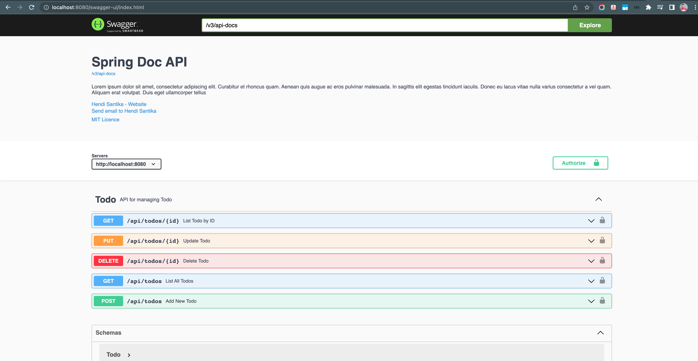
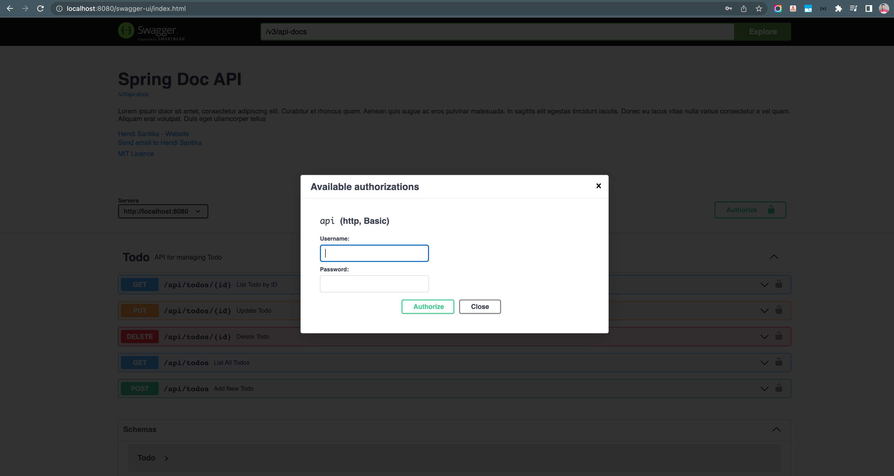

# springdoc-api-demo2

### Things todo list

1. Clone this repository: `git clone https://github.com/hendisantika/springdoc-api-demo2.git`
2. Navigate to the folder: `cd springdoc-api-demo2`
3. Run the application: `mvn clean spring-boot:run`
4. Open your favorite browser: https://localhsot:8080/swagger-ui

### Image Screen shots

Swagger UI Page

\
